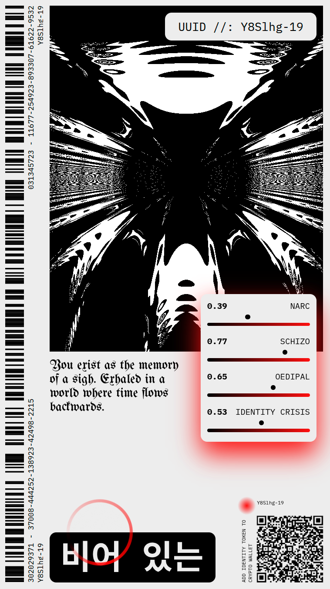

# Generating the Identity Token

*This is a text about an art installation that we first exhibited in 2024. During the performance we noticed some congruence, since some people took our pseudo-medical device for real. Find the the theoretical underpinnings of the piece documented here. I thank my partner for pulling the piece together with me and feeding me during the performance.*

*"비어 있는" – You are the living void. Re-substantiating the relinquished self which was never yours to begin with.*

## I. The Scene

An apparatus stands in the room, functional in appearance, clinical in its coolness. Visitors are invited to insert a saliva sample tube into an opening. LEDs flash. A loading bar crawls across the screen, accompanied by occult metrics: *Karmic Debt Accumulation 33%*, *Quantum Entanglement 80%*, *Family Trauma Score 45%*. At the end, a personalized shader appears—a pulsating ink blob, mathematically generated from parameters that flash on the screen: NARC 0.73, SCHIZO 0.41, OEDIPAL 0.89, IDENTITY CRISIS 0.96.

A performer in a white coat, clipboard in hand, steps forward. With a serious expression, she notes the values, nods knowingly, begins to deliver a pseudoscientific interpretation and life advice. The visitor listens attentively. She believes it. Despite the obvious absurdity of the metrics—*Karmic Debt*, as if karmic indebtedness could be expressed in percentages—despite the theatrical staging, despite the impossibility of extracting an *Oedipal Index* from saliva, many visitors take the "diagnosis" seriously. Not ironically or playfully, but with a genuine willingness to recognize themselves in it.

The installation "Generating the Identity Token" was developed for the exhibition "Helth," which addresses postmodern self-optimization practices. It is a satire, but one that exceeds its own boundaries.

## II. The Pathology of Health

Why now? Why, at this particular moment, do we find ourselves so preoccupied with measuring, diagnosing, and optimizing ourselves?

Consider orthorexia nervosa—a term coined in 1997 to describe an obsessive fixation on "healthy" or "pure" eating. It is not yet an official diagnosis in the DSM, but it is under serious consideration, and consensus criteria have been proposed. The condition is characterized by rigid, self-imposed dietary rules, emotional distress when confronted with foods perceived as unhealthy, and a preoccupation with food quality that paradoxically leads to malnutrition and impaired well-being.

What is remarkable about orthorexia is not the behavior itself—people have always had dietary restrictions, taboos, rituals around food. The very pursuit of wellness, taken to its logical extreme, seemingly produces illness. The person with orthorexia is not indifferent to health; they are *too* devoted to it. Their sickness is an excess of the cure.

This is not an accident. Orthorexia is a symptom of a broader cultural formation—one in which health has become a moral imperative, self-optimization a duty, and the body a project to be endlessly monitored and improved. The proliferation of wellness apps, fitness trackers, biohacking communities, clean-eating movements: all of these participate in a regime that demands constant attention to the self as a measurable, optimizable object.

Also the fact that this very attention can become pathological—that it is now being considered for inclusion in the diagnostic manual—is itself significant. We are witnessing in real time the process that Ian Hacking called "making up people": a cultural practice becomes widespread, produces recognizable patterns of behavior and distress, attracts clinical attention, receives a name, and thereby becomes a "kind of person" that one can be. The diagnosis does not simply describe a pre-existing condition; it participates in constituting the condition it names.

This is the context for the installation. It speaks to a moment in which the measurement of the self has become compulsive—a moment in which we are not merely *willing* to be measured but actively *seek* measurement, as if the numbers could tell us who we are. The visitor who submits to the absurd apparatus is not an anomaly; she is a figure of our time. She has been prepared, by countless prior encounters with metrics and diagnoses, to receive the judgment of the machine.

The question the installation poses is not whether this particular measurement is valid—obviously it is not. The question is why we have become the kind of people for whom measurement, any measurement, feels like an answer to the question of who we are.

## III. The Willingness to Be Diagnosed

The authority of measurement is nearly unquestioned in late-modern societies. What can be measured exists; what cannot be measured is doubtful. This logic pervades not only the sciences but everyday self-relation: steps are counted, sleep phases tracked, heart rate variability monitored. The Quantified Self movement carries its motto in its name: "Self-knowledge through numbers." Deborah Lupton describes in *The Quantified Self* (2016) how these practices constitute a new relationship to the self, in which data is considered "truer" than lived experience.

The authority of the white coat is older but no less effective. It points to what Michel Foucault analyzed as the connection between knowledge and power: whoever diagnoses has power over the diagnosed. But this power is, as the installation shows, partly *staging*. The white coat, the clipboard, the serious gaze—all of these are props in a performance that establishes authority before a word is spoken.

The visitors to the installation know this in a certain sense. And yet: they play along. Not because they are foolish, but because the promise of a diagnosis is too alluring. A diagnosis promises explanation, classification, identity.

## IV. Making Up People

In his influential essay "Making Up People" (1986, expanded 2006), Ian Hacking described a mechanism he calls *looping effects*. The thesis is simple and far-reaching: diagnoses create the people they describe.

"We think of these kinds of people as definite classes defined by definite properties," Hacking writes. "But it's not quite like that. They are moving targets because our investigations interact with them, and change them. And since they are changed, they are not quite the same kind of people as before. The target has moved. I call this the 'looping effect'. Sometimes, our sciences create kinds of people that in a certain sense did not exist before."

The classic example is Multiple Personality Disorder, now called *Dissociative Identity Disorder*. The renaming, according to Hacking, was more than diagnostic housekeeping: "Symptoms evolve, patients are no longer expected to come with a roster of altogether distinct personalities, and they don't." The diagnosis shaped the symptoms, the symptoms confirmed the diagnosis—a cycle without a stable reference point.

What Hacking described for psychiatric classifications echos algorithmic attributions. TikTok diagnoses are a prime example. Studies show that more than half of ADHD-related TikTok videos are scientifically inaccurate. Nevertheless, many users report "recognizing themselves" in the descriptions. Alper et al. call this phenomenon *algorithmically mediated biographical illumination*: the platform doesn't just convey information, it actively shapes users' self-understanding.

The anthropologist Toby Locke goes further, provocatively claiming: "TikTok is ADHD." The platform creates an environment that doesn't just mirror ADHD-typical experiences but produces them as attention spans decline with excessive use.

## V. Diagnosis Without Etiology

If diagnoses create the people they describe, we must ask: what do diagnoses actually *know*?

Psychiatric diagnosis has an epistemic problem that is rarely openly acknowledged: it is descriptive, not etiological. The *Diagnostic and Statistical Manual of Mental Disorders* (DSM) describes symptom clusters but does not explain causes. The diagnosis "depression" says nothing about *why* someone is depressed—it establishes that certain symptoms are present.

Allen Frances, who as chair of the DSM-IV Task Force was one of the architects of modern psychiatric diagnostics, has become one of its sharpest critics. In *Saving Normal* (2013), he warns of a "diagnostic exuberance" that confuses "mental disorder with the everyday sadness, anxiety, grief, disappointments, and stress responses that are an inescapable part of the human condition."

The problem is not only the expansion of diagnoses but their *reification*: the transformation of a descriptive construct into a thing. The DSM system, according to Hyman (2010), "creates epistemic blinders that impede progress toward valid diagnoses." What began as a pragmatic convention—a common language for clinicians—is treated as if it designated natural entities.

What purpose does diagnosis serve if it explains nothing etiologically? It serves billing, administration, and research. It also enables insurance benefits, justifies medication, structures institutions and if we are lucky is used to individualize treatment. Diagnosis is a tool of governance.

## VI. From Discipline to Control

Diagnosis as governance: this insight opens onto a broader transformation in how power operates: In 1990, Gilles Deleuze published a short, prophetic text: "Postscript on the Societies of Control." In it, he describes a transformation of power technologies that continues and surpasses Foucault's analysis of the disciplinary society.

Disciplinary society, according to Foucault, operated through enclosure: school, barracks, factory, prison, hospital. Each institution shaped the individual according to its rules—discrete molds through which the individual passed one after another. "Enclosures are molds, distinct castings," Deleuze writes.

The society of control, by contrast, operates through *modulation*: "Controls are a modulation, like a self-deforming cast that will continuously change from one moment to the other, or like a sieve whose mesh will transmute from point to point." No more fixed forms, but constant flowing, adapting, readjusting. Deleuze's diagnosis of the new subject: "Individuals have become 'dividuals,' and masses, samples, data, markets, or 'banks.'" The *dividual* is no longer an indivisible individual but a bundle of data points that are aggregated, sorted, and evaluated differently depending on context.

For the healthcare system, this means, as Deleuze noted already in 1990: "The new medicine 'without doctor or patient' […] singles out potential sick people and subjects at risk, which in no way attests to individuation—as they say—but substitutes for the individual or numerical body the code of a 'dividual' material to be controlled."

The psychiatric diagnosis may be, from this perspective, a hinge between the old disciplinary society and the new society of control. It originates in the world of institutions of enclosure—the clinic, the asylum—but it can be effortlessly translated into the world of algorithmic modulation. An ADHD score, a depression index, a suicide risk profile: these are no longer diagnoses in the clinical sense but parameters for continuous surveillance and intervention. "Perpetual training tends to replace the school," Deleuze writes, "and continuous control to replace the examination." The key term is *continuous*. Disciplinary society examined at discrete points—at the end of the semester, upon hiring, upon discharge. The society of control evaluates uninterruptedly, namely every click, every heart rate, every sleep phase flows into a profile that updates in real time. Algorithmic governmentality, as recent theorists describe it, "extends Foucault's concept of biopolitics by transforming human subjects into data points that can be sorted, ranked, and controlled based on algorithmic predictions."

The decisive difference from classical biopolitics: it is no longer about the *norm*. Classical statistics sought the average, the normal distribution, the acceptable range. Algorithmic governance, by contrast, is "devoid of any relation to the average or the norm." Its goal is not normalization but *prediction*: "The aim of these new data processing systems is data aggregation. Diagnosis once served to distinguish the abnormal from the normal in order to treat, isolate, or normalize the abnormal. The algorithmic category, by contrast, serves to predict and modulate behavior—regardless of whether it is "normal" or not. Everyone is a risk profile. Everyone is a potential customer, a potential criminal, a potential patient.

## VII. The Inductive Turn

The shift from normalization to prediction has an epistemological correlate: what is often called the *inductive turn* or *data-driven science*. In 2008, Chris Anderson, then editor-in-chief of *Wired*, published a provocative article titled "The End of Theory." His thesis: the availability of massive amounts of data renders the scientific method—hypothesis, model, test—obsolete.

"Forget taxonomy, ontology, and psychology. Who knows why people do what they do? The point is they do it, and we can track and measure it with unprecedented fidelity […] the numbers speak for themselves." And further: "Correlation supersedes causation, and science can advance even without coherent models, unified theories, or really any mechanistic explanation at all."

The parallel to psychiatric diagnosis is striking. Just as the DSM describes without explaining, Big Data correlates without understanding. Both claim a kind of epistemic modesty—we don't know *why*, but we know *that*—while in fact exercising enormous power through their categories.

The response from philosophy of science was fierce. Massimo Pigliucci countered: "The numbers, contrary to Anderson's bold assertion, do not, in fact, speak for themselves." He quotes Darwin: "How odd it is that anyone should not see that all observation must be for or against some view if it is to be of any service!". The critique is an epistemological painpoint. The idea of a "hypothesis-free" science that distills knowledge from pure correlations fails to recognize that data collection itself requires theoretical pre-decisions.

## VIII. The Theory-Ladenness of Observation

In *The Structure of Scientific Revolutions* (1962), Thomas Kuhn showed that there is no neutral observation language. "Observation is so theory laden," the Stanford Encyclopedia of Philosophy summarizes his position, "that people working in competing paradigms can disagree even about the basic observational data."

The paradigm—Kuhn's central concept—provides not only theories but the tools with which scientists work: the instruments, the methods, the questions considered legitimate. Paradigms are, in Kuhn's formulation, "constitutive of the research activity." They determine what counts as a phenomenon and what does not.

Between different paradigms there is *incommensurability*: "There is no theory-neutral language or set of observations by which competing paradigms can be directly and completely compared." A paradigm shift is less a progression than a *gestalt switch*—the world itself appears different.

What does this mean for self-measurement? The apps and wearables that quantify our lives are not neutral recording devices. They are apparatuses that constitute phenomena. The categories into which they sort our data—sleep quality, stress level, productivity—precede the "measurement." We don't discover who we are; we are fitted into prefabricated categories that echo a hegemonic system with its own incentives…

Earlier in the 20th century, in *Phenomenology of Perception* (1945), Maurice Merleau-Ponty deconstructed the idea of "pure sensation." "The alleged self-evidence of sensation," he writes, "is not based on any testimony of consciousness, but on widely held prejudice." Merleau-Ponty critiques both empiricism and intellectualism for their shared presupposition of a "ready-made world." Both read the results of perception—the objective world—back into perceptual experience, thereby falsifying its characteristic structure. Perception, according to Merleau-Ponty, is always *bodily situated*. "'I think' is dependent on 'I am.' Even in the sphere of so-called 'pure thought'—geometrical thinking, for example—one's grasp of truth is dependent on one's bodily orientation to the world."

There are no facts without a standpoint from which they appear as facts. There are no data without an apparatus that constitutes them as data.

One century earlier, In his *Science of Logic*, Hegel argued that thought and being form a unity: "Hegel's logic is a system of dialectics, i.e., a dialectical metaphysics: it is a development of the principle that thought and being constitute a single and active unity."

Against the "naive view" according to which "we gain knowledge of the world by using our senses to pull the world into our heads" and "our knowledge of the world is basically a mirror or copy of what the world is like," Hegel sets the dialectical insight that "the participating activity is itself the precondition of observation." Participation precedes observation. We do not stand opposite the world like an object that we passively copy. We are always already entangled in practices that co-constitute what appears as fact.

For Big Data, this means: the algorithms that "discover" patterns in data discover patterns that they have co-constituted. The categories they use, the weightings they apply, the correlations they deem significant—all of this is not a neutral representation of a prior reality but an active intervention in what counts as reality.

## IX. The Hidden Theory of Control

If all observation is theory-laden, if there are no pure phenomena, if participation precedes observation—then we must ask: what theory underlies the supposedly theory-free inductive turn? What paradigm structures the paradigm-free data science?

The answer lies in the function, not the content. The inductive method claims to have no theory, no hypothesis, no presupposition. But this very claim *is* a theoretical position—one that serves a specific purpose: *control*.

A theory that explains is a theory that can be contested. If I say "you are depressed because of a chemical imbalance," you can question the model, demand evidence, propose alternatives. But if I say "you score 0.73 on the depression index"—what is there to contest? The number simply *is*. It presents itself as pure description, beyond argument.

This is the epistemological sleight of hand at the heart of the inductive turn. By refusing to explain, it immunizes itself against critique. By claiming to merely correlate, it hides its constitutive power. The apparatus that measures you also produces the categories by which you become measurable. But because it offers no theory, there is no theory to reject.

There is a violence in this operation—not physical, but no less real. To be datafied is to be made into an object. The subject who is measured, categorized, predicted is no longer a subject in the full sense; it is a target, a profile, a risk score. It becomes something to be managed rather than someone to be encountered. This is the violence of objectification: the reduction of a who to a what.

The categories themselves reveal the hidden logic. Why does the Quantified Self movement track "productivity" rather than "contemplation"? Why "sleep efficiency" rather than "dream vividness"? Why "steps" rather than "stillness"? These are not neutral choices. They are selections that privilege what can be optimized, managed, controlled—and exclude what cannot.

The same applies to psychiatric diagnosis. The expansion of diagnostic categories is not a neutral scientific progress. Each new category creates a new population that can be identified, monitored, treated, managed. Diagnosis is less a tool of understanding than an instrument of governance—a way of making subjects legible to systems of control.

But control for what purpose? Here we must be careful not to reduce everything to a single logic—but we also must not be naive. The purposes are multiple: administrative efficiency, risk management, political surveillance. And, not least: the production of consumers. A subject who is endlessly measured, endlessly categorized, endlessly told what it lacks, is a subject primed for consumption. Each metric reveals a deficiency; each deficiency suggests a product.

The irony is that this very knowability produces its opposite. The subject who is endlessly processed does not become more known—it becomes more empty. For genuine knowing requires encounter, and encounter requires an Other who can respond. The algorithm does not respond; it only calculates. It fills the place of the Other without being one.

## X. Language Constitutes Its Object

There is a structural parallel here that deserves to be made explicit.

In epistemology, we have seen that theory is not a neutral lens through which we observe a pre-given world. Theory *constitutes* its object. The paradigm determines what counts as a phenomenon, what counts as data, what counts as a relevant question. There is no access to "raw reality" unmediated by the conceptual apparatus that makes observation possible in the first place. This is Kuhn's insight, Merleau-Ponty's insight, Hegel's insight: language and thought do not merely describe the world; they participate in bringing it forth.

In psychoanalysis, we find the same structure. The subject is not a pre-given entity that then learns to speak, to communicate, to enter into relation with others. The subject *is constituted* through language, through communication, through the encounter with the Other. There is no "true self" hidden behind the masks of social interaction, waiting to be discovered. The self emerges in and through the symbolic order—it is, from the beginning, a linguistic being, a relational being, a being that exists only in the space between itself and the Other that mirrors it.

Just as there are no theory-free facts, there is no language-free self. The self thinks and speaks to itself in language and in epistemological categories that are borrowed from the symbolic order of human society.

This is why the promise of algorithmic self-knowledge is structurally impossible to fulfill. The apparatus promises to reveal who you "really" are—beneath the social masks, beyond the distortions of self-perception, in the pure objectivity of data. But there is no such "really." The self that the algorithm claims to measure is already constituted by language, by categories, by the very diagnostic frameworks that purport to describe it. The measurement does not discover a pre-existing truth; it participates in producing the subject it claims to observe.

Hacking's looping effects operate at this level. The diagnosis of ADHD does not simply identify a pre-existing condition; it provides a language, a framework, a way of understanding oneself that shapes how one experiences and performs one's own attention, one's own impulses, one's own relation to time. The subject becomes what it is named—not because the name magically transforms it, but because subjectivity itself is constituted through such naming, such categorization, such interpellation by the Other.

The difference between scientific observation and subject-constitution is not that one is linguistic and the other is not. Both are thoroughly linguistic. The difference is that the scientific object does not hear itself being named—but the subject does. The subject is the being for whom being-categorized *matters*, for whom the gaze of the Other is not merely informational but existentially constitutive. The language of metrics becomes the language through which the subject understands itself. And in that language, there is no room for the aspects of subjectivity that exceed measurement: the irreducible singularity, the capacity for genuine novelty, the opening toward an Other who might see what no algorithm can calculate.

## XI. The Closed Loop

The installation "Generating the Identity Token" makes visible what remains hidden in the algorithmic systems of self-measurement: the closed loop of measurement and constitution.

The visitor submits saliva—a biological datum. The apparatus "analyzes"—a black box. The screen displays parameters—NARC, SCHIZO, OEDIPAL. The performer interprets—an authority. The visitor recognizes herself—a looping effect.

And yet: the visitors find meaning. They recognize themselves in the absurd metrics because the readiness for self-recognition through external attribution is so deeply anchored that even obvious nonsense functions as a mirror. This is what Lacan understood: the subject is constituted through the gaze of the Other, through language, through the symbolic order. We *need* something outside ourselves to tell us who we are.

The installation exploits this need. It offers the form of recognition without its substance. It provides categories, metrics, interpretations—all the apparatus of being-seen—but without anyone who actually sees. The visitor is not recognized; she is processed. She is not understood; she is classified. This is why the visitors submit willingly. Not because they are foolish, but because the promise of being seen is irresistible—even when, on some level, they know the seeing is empty. The need for the Other is so fundamental that we will accept its simulacrum rather than face its absence.

Byung-Chul Han calls this "psychopolitics": power that operates not through repression but through the colonization of the psyche itself. The achievement-subject does not need external discipline; it disciplines itself, optimizes itself, measures itself—seeking in data what can only be found in relation. But Han's critique, while incisive, risks reducing this to a matter of neoliberal ideology. The problem is older and deeper than capitalism. It is the problem of the subject itself.

"Cogito ergo sum"—I think, therefore I am. Descartes' formula marks the beginning of modern subject philosophy. The self constitutes itself in the act of thinking; the self-certainty of the thinking I is the only indubitable foundation.

Self-measurement inverts this formula: *I measure, therefore I am.* The self no longer constitutes itself in thinking but in the data trail. I am what my trackers know about me. My identity is the sum of my metrics.

But these metrics are not neutral. They flow away—into databases, to corporations, into training datasets for machine learning. They return—as personalized advertising, as product recommendations, as algorithmic attributions that pack me into consumer categories.

Lupton calls this "exploited self-tracking": personal data are "taken up and repurposed for commercial, governmental, managerial and research purposes." The same data with which I believe I am coming to know myself are used to categorize me as a target audience. It is the same system. Self-measurement and consumer profiling share the same architecture: embedding spaces, preference optimization, algorithmic attribution. What begins as self-knowledge ends as external categorization.

## XII. The Empty Subject constitutes itself in Communication

Jacques Lacan described the subject as fundamentally split, fundamentally lacking. The ego (*moi*) is an imaginary construct, an identification with one's own mirror image—always alienated, always elsewhere. The subject (*je*) emerges only in the field of the Other—in language, in symbolic exchange, in the gaze of the counterpart.

This means: the subject is constitutively *alienated* from itself. It does not first exist as a self-transparent unity that then enters into relation with others. It becomes a subject *through* relation—and therefore never fully coincides with itself. The self is always, in some sense, a stranger to itself. This is not a defect to be remedied but the condition of being human.

The subject's desire is, according to Lacan, always the desire of the Other. We desire what the Other desires; we want what the Other considers desirable. The *objet petit a*—the small object that we desire—is not a real object but a placeholder for a lack, a void that can never be filled. This void is not accidental, the subject *is* this void, this gap, this permanent incompleteness that drives it toward the Other.

Self-measurement promises to overcome this alienation. Data is supposed to tell me who I am—to give me access to myself, to make me transparent to myself. The algorithm presents itself as a path to self-knowledge, perhaps even to self-coincidence: finally, I will know who I really am. But data has no gaze. The algorithm is not an Other.

The mirror that self-measurement offers is a mirror without a gaze. It reflects patterns, not recognition. It produces categories, not encounter. The subject remains alienated—but now its alienation is *administered*, managed, categorized.

And here we must recognize a darker dynamic. The constitutive alienation of the subject—its structural strangeness to itself—is not only a given; it is *instrumentalized*. Not necessarily through conspiracy or intention, but through structural affinity: alienation "works well" for certain arrangements of power. A subject that is at home in itself, that knows what it wants, that rests in its own ground, is a subject that resists manipulation. But an alienated subject, a subject uncertain of itself, perpetually seeking itself—this subject is *available* for control, for management, for consumption.

The systems of measurement do not heal this alienation; they *deepen* it. Each metric reveals another gap between who I am and who I should be. Each diagnosis names another way in which I fail to coincide with myself. Each category offers an identity—but an identity that comes from outside, that must be adopted, performed, maintained. The more I am measured, the more I become a stranger to myself.

And into this deepened alienation flow the offers: identity offers, lifestyle offers, consumer offers. The diagnosis of ADHD comes with a pharmaceutical solution. The productivity score comes with an app ecosystem. The personality type comes with a community, a wardrobe, a reading list. The void that measurement produces is immediately filled—but filled with objects that cannot satisfy, because they are not what the subject truly seeks.

What the subject seeks is not an object at all. It seeks the Other—the genuine Other who sees, responds, is changed by the encounter. But the algorithm offers only more of the same: more data, more categories, more refined alienation. The circle closes: alienation produces neediness, neediness is filled with offers, the offers produce new alienation.

This is the loop that the installation makes visible. The visitor submits to measurement seeking self-knowledge. She receives a diagnosis—NARC 0.73, OEDIPAL 0.89—that tells her who she is. But the diagnosis does not bring her closer to herself; it inserts another layer of mediation, another external category through which she must understand herself. She leaves more alienated than she came, clutching an "identity token" that is simultaneously hers and utterly foreign. She has been processed, not met.

## XIII. Orthorexia

It is no accident that orthorexia—the pathological obsession with healthy eating—has emerged as a diagnostic category precisely in this moment in time. Eating disorders have always been, psychodynamically, about regaining control and autonomy in times of change. But orthorexia reveals something specific about our moment: it is the eating disorder of the quantified self, the eating disorder of the wellness app, the eating disorder that speaks the language of optimization and purity rather than restriction and thinness.

The person with orthorexia does not simply tries to control food intake; they *measure*. They count not (only) calories but toxins, additives, inflammatory markers. They track purity, cleanliness, health scores. They submit their bodies to the same regime of datafication that pervades every other domain of contemporary life. In this sense, orthorexia is the epicenter of the health practices we have been examining—not an aberration but a concentrated expression of the logic that governs the whole field.

And yet, beneath the obsession with health lies something else: a desperate attempt to regain control in a world that feels uncontrollable. The subject who cannot define itself, who finds its traditional coordinates dissolving—stable work, stable relationships, stable identity—turns to the one domain that still seems manageable: the body, the intake, the metric. If I cannot control my life, at least I can control what I eat. If I cannot know who I am, at least I can know my numbers.

But why are these coordinates dissolving? The subject is lost, first and foremost, because social bonds and roles are dissolving in late modernity. We are increasingly isolated, increasingly alone. And yet our entire consciousness emerged from communication and is oriented toward communication—that is its purpose, its telos. We are social beings to the core; the self is not a monad but a node in a web of relations. Without the Other, there is no self.

What we receive instead is the pseudosocial: a simulacrum of relation, a counterfeit of encounter. Social media, algorithmic feeds, digital "communities"—all of these feel, at first, like what we need. They offer the form of connection: likes, comments, followers, the sense of being seen. But they are not what they appear to be. They do not provide genuine encounter, genuine recognition, genuine response. The algorithm does not see you; it processes you. The feed does not know you; it optimizes for engagement. The "community" is not a web of mutual obligation but a market segment.

And so the pseudosocial does not heal our isolation—it deepens it. We are thrown back upon ourselves, more alone than before, unable to define ourselves without the Other and yet deprived of any genuine Other. We scroll through the simulacrum of sociality, seeking recognition, finding only metrics. We are rendered powerless and alone in a world that offers endless connection and no genuine contact.

This is why we cling to measurement. It is the one thing we still have in our hands. In a world that renders us powerless—over our work, our relationships, our futures—the body remains. The calorie count remains. The step count remains. The health score remains. These are small dominions, pathetic perhaps, but ours. The metric offers the illusion of agency in a world that has stripped agency away. If I cannot control anything else, at least I can control this number. If no one else sees me, at least the app tracks me.

The installation "Generating the Identity Token" captures this dynamic in miniature. The visitor submits to an absurd measurement not despite its absurdity but because any measurement, any external attribution, any semblance of being known feels better than the void. She accepts the nonsense diagnosis because it is *something*—a category, a number, an identity token. In a world where genuine recognition has become scarce, even its parody is preferable to nothing.

This is the tragedy of the quantified self: not that measurement is inaccurate, but that it is accepted as a substitute for what cannot be measured. The subject seeks the Other and finds only data. It seeks recognition and finds only classification. It seeks to be known and finds only to be processed. And so it measures itself, endlessly, hoping that the next metric will finally tell it who it is—while the genuine answer lies elsewhere, in an encounter that no algorithm can provide.

*"비어 있는" – empty, and therefore open.*References

Alper, M., Rauchberg, J. S., Simpson, E., Guberman, J., & Feinberg, S. (2023). TikTok as algorithmically mediated biographical illumination: Autism, self-discovery, and platformed diagnosis on #autisktok. *New Media & Society*, 27(3), 1378–1396. [https://doi.org/10.1177/14614448231193091](https://doi.org/10.1177/14614448231193091)

Anderson, C. (2008, June 23). The end of theory: The data deluge makes the scientific method obsolete. *Wired*. [https://www.wired.com/2008/06/pb-theory/](https://www.wired.com/2008/06/pb-theory/)

Deleuze, G. (1992). Postscript on the societies of control. *October*, 59, 3–7. (Original work published 1990)

Frances, A. (2013). *Saving normal: An insider's revolt against out-of-control psychiatric diagnosis, DSM-5, Big Pharma, and the medicalization of ordinary life*. William Morrow.

Hacking, I. (2006, August 17). Making up people. *London Review of Books*, 28(16), 23–26. [https://www.lrb.co.uk/the-paper/v28/n16/ian-hacking/making-up-people](https://www.lrb.co.uk/the-paper/v28/n16/ian-hacking/making-up-people)

Han, B.-C. (2017). *Psychopolitics: Neoliberalism and new technologies of power* (E. Butler, Trans.). Verso. (Original work published 2014)

Hegel, G. W. F. (2010). *The science of logic* (G. di Giovanni, Trans.). Cambridge University Press. (Original work published 1812–1816)

Hyman, S. E. (2010). The diagnosis of mental disorders: The problem of reification. *Annual Review of Clinical Psychology*, 6, 155–179. [https://doi.org/10.1146/annurev.clinpsy.3.022806.091532](https://doi.org/10.1146/annurev.clinpsy.3.022806.091532)

Kuhn, T. S. (1962). *The structure of scientific revolutions*. University of Chicago Press.

Locke, T. A. (2023). In the cracks of attention: ADHD, vernacular anthropologies and communities of care on TikTok. *Teaching Anthropology*, 12(1), 23–35. [https://doi.org/10.22582/ta.v12i1.683](https://doi.org/10.22582/ta.v12i1.683)

Lupton, D. (2016). *The quantified self: A sociology of self-tracking*. Polity Press.

Merleau-Ponty, M. (2012). *Phenomenology of perception* (D. A. Landes, Trans.). Routledge. (Original work published 1945)

Pigliucci, M. (2009). The end of theory in science? *EMBO Reports*, 10(6), 534. [https://doi.org/10.1038/embor.2009.111](https://doi.org/10.1038/embor.2009.111)

---

Lacan, J. (2006). *Écrits* (B. Fink, Trans.). W. W. Norton & Company. (Original work published 1966)  
Foucault, M. (1977). *Discipline and punish: The birth of the prison* (A. Sheridan, Trans.). Pantheon Books. (Original work published 1975)
